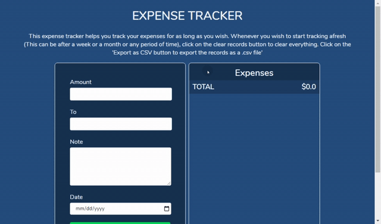

# Expense Tracker

This expense tracker helps you track your expenses for as long as you wish. Whenever you wish to start tracking afresh ( This can be after a week or a month or any period of time ), click on the clear records button to clear everything. Click on the 'Export as CSV button' to export the records as a .csv file.  -- Manaswini  
A clone of [Manaswini / Expense-Tracker](https://manas-expense-tracker.netlify.app/) with better styling though. Nicely done

